<SEO title="Suikoden V any%" />

### Sol-Falena
Ferid Option 1
Arshtat Option 1

### Lordlake
Run to Lore Revere's Manse, Option 1
Go to Balcony, watch Cutscene. After cutscene, pick up **Sacrificial Jizo** on ramp to the southwest.
Lord Revere's Balcony exit is near bottom of screen

Head to dock for Talgeyl / Goesch cutscene.
Option 1 to let Lyon look for Tomo
Go to Withered Forest

<Menu>

##### Swap
Sialeeds > Entourage

</Menu>

### Withered Forest
Down, cross bridge, left then right all the way.
Option 1 to save Toma

> Don't forget this game has memory cursor :)
> Tested attacking 3rd Ulse with others, same speed/slower and chance of Prince dying.

#### 3 Ulse
 - T1 & 2: Georg Attack, rest Defend
 - T3: Auto

### Sol-Falena
Arshtat: "It serves them right", Lyon: "Your Majesty" **Option 2**
Lyon: "People who had nothing to do with the uprising." **Option 2**
Sialeeds: "Heh, like I need to ask..." Option 1

> According to LCC's notes, this is 1s slower. According to CTW, this saves 2s later via Lym affection stuff.

West upstairs to princess's (last) room, talk to closest girl there. Option 1
Go up middle area spiral stairs to Sun Rune room and go through dialogues.
East and downstairs to far east knight's room.

Lyon: "Wow, they talk like this in the HALLS now?" Option 1
Kyle: "Hey, you guys should come visit the Queen's Knights' guard room with me!" **Option 2**

> 3 minute break from entering guard room to Option 2, 2m after.

Zahak: "We are terribly sorry, your highness." **Option 2**
When Kyle leaves your party and you get control leave Guard Room right away.
Lyon: "Gee, the princess is sure crazy..." Option 1

Miakis: "Oh my, my, my!" **Option 2**
Lym: "Hey, Hero. What about you? Would you hate it..." Option 1

Once everyone joins your party, leave the guard room.

Lym: "Hero, Aunt Sialeeds is scaring me!" **Option 2**

Do this menu anytime between now and when Miakis leaves your party after Senate.

<Menu>

##### Unequip All
 * Kyle
 * Miakis

##### All Best
 * Hero
 * Lyon
 * Sialeeds

</Menu>

Go to Senate.

1. Talk to Official slightly below entrance on the way to stairs down.
2. Enter Center Room for Barows cutscene.

Salum: "Lucky man today...", "Yes, hahaha..." **Option 2**
Sialeeds: "Hero, Lym, what did you think?" **Option 2**

3. Talk to Official southwest of center room, standing by bottom floor exit.
4. Go upstairs on left side and walk to North guy blocking door to trigger cutscene.

Official (2 textboxes total): "I'm so very sorry!..." **Option 2**
Official: "Well, let's see. We have about 70 applications." **Option 2**

Exit Senate, going around bottom side (don't take stairs) and first exit.

Miakis: "Princess, you should get back to your room.", Lym: "Yeah, guess you're right..." **Option 2**
After Sialeeds leaves, Lyon: "Prince, what do you want to do now?" **Option 2**

After scene go south to next screen, west then south across bridge and west to rune shop. After cutscene talk to runemaster.

<Menu>

##### Unequip
 * Kyle: Water Rune

</Menu>

Kyle: "Hey Prince, I'm gonna go check this out." Option 1

#### IMPORTANT, DON'T FIGHT THUGS
Kyle: "Your Highness, how do you want to handle this?" **Option 2**

Run back to Palace same way you came.

Lyon: "But, of course, you know I'll protect you no matter what happens!" **Option 2**

South all the way to pier.

> 1m15s from getting on ship to dialogue option. 1m45s after dialogue to Zadom. 1m5s after Zadom.

Lyon: "Her Majesty is really very kind. Right, Prince?" Option 1

#### Zadom 1000HP
Auto

> Option 1 is faster by 1s, assume this is for affection.

Georg: "Hmmm...", "Hero, what do you think?" **Option 2**

### Stormfist
Gizel: "We'll have a banquet tonight. Until then..." **Option 2**

Left for scene, enter Arena.

#### Arena
Go left for scene. ~1m30s before dialogue.
Gizel: "Your Royal Highness, what do you say?." **Option 2**

After scene go down to Stands for cutscene.
Euram: "You honor me, big brother!" **Option 2**

Go right to leave stands, go downstairs. Go north to screen above, go right right away to enter Infirmary. Go to Basement.

Go right twice to trigger 2 different cutscenes.
First Cutscene, Gizel: "Well, they are slaves." **Option 2**.

Leave infirmary and go south twice, then go up stairs and watch cutscene, then go back downstairs and trigger another cutscene.

Gizel: "Quite a festival in the streets, with the Sacred Games approaching." **Option 2**

#### Town
Head south then east into alley for Shoon cutscene.
Lyon: "I'm turning left at..." **Option 2**
Shoon: "This isn't what it looks like!" **Option 2**

Go west to inn. After scene head back to Coliseum.
Sialeeds: "Well, it's been a long trip, we're all tired, ..." **Option 2**

Talk to Item Shop or Armor Shop.

<Menu>

##### Sell
 * From bottom, everything above Breath of Ice S1 until Mega Medicine.
 * Hero: Defence Ring, Flaming Arrows, Silver Emblem
 * Lyon: Clay Guardian
 * Georg: Everything
 * Sialeeds: Everything

</Menu>

Talk to Rune Shop (top left corner, closest to Arena Entrance)

<Menu>

##### Buy
 * 1 Lightning Orb
 * 1 Breath of Ice S3
 * 1 Berserk Blow S3
 * 2 Dancing Flames S3

##### Equip
 * Lightning > Hero

</Menu>

Head back to inn. Talk to Shoon, **Option 2**.

#### Sewers

<Menu>

##### Equipment > Equip
 * Dancing Flames > Hero top slot
 * Dancing Flames > Lyon 2nd slot
 * Berserk Blow > Hero bottom slot
 * Breath of Ice S3 > Lyon top slot
 * Breath of Ice S3 > Hero 2nd slot
 * Breath of Ice S1 > Sialeeds

> This is kinda optional now
##### Skills > Equip
 * Lyon & Prince: Magic top slot (ULU to select Magic)

##### Swap
 * Shoon > Entourage

</Menu>

 1. East then left across bridge.
 2. Southwest across bridge then northeast across bridge.
 3. Southwest at save crystal then northwest and press button.
 4. Head back to save crystal, then go northwest.

Gladiator: "They're coming from over that way..." **Option 2**
Go northwest to trigger cutscene.

Suspicious Man: "Withdraw", Lyon: "Prince!" **Option 2**

#### Suspicious Men 250HP
##### Turn 1
 * Hero: Dancing Flames Center (1D)
 * Lyon: Breath of Ice Scroll
 * Georg: Defend
 * Sialeeds: Defend

#### Prison
Euram: "Neither Dad nor I knew anything about it!" **Option 2**
Leave prison.

Back in your room, Lyon 1 textbox then **Option 2**
After Sialeeds: "Gizel...", 3m10s no input until dialogue choice.

Lyon: "Just relax and take it easy." **Option 2**
Lyon (2 textboxes): "Oh, and Prince, you do know..." **Option 2**
After Lyon leaves your party go southeast (don't mash)

Shoon: "I'm looking forward to this." Option 1

#### Shoon Duel
Special vs Guard about same time.

| Opponent Dialogue                       | Opponent Action |
|-----------------------------------------|-----------------|
| Here comes another one, and this time   | Special         |
| Here I come!                            | Attack          |
| I can't believe you turned my best...   | Guard           |
| I can't let you keep getting the...     | Attack          |
| I'm going to give it all I've got, be   | Special         |
| Not good enough, eh? Here I come again! | Attack          |
| Now its my turn, I'll show you what...  | Special         |
| You come at me too, Prince.             | Guard           |

Lym: "No way! It's just not right! Brothers and sisters..." **Option 2**

Go to Royal Box. After Lym and Miakis leave party run southeast then southwest to your seat.

Lym: "I know... But I have this cold feeling..." **Option 2**

> 3m15s before next dialogue option

Ferid: "Seems very interesting...", "How about it? Would you like to meet him?" Option 1

> 1m25s after dialogue option

After Nikea scene, enter town and head northwest.

Lyon: "That's awful!", "Prince!" **Option 2**

#### Thug x5 260HP
 * Hero: Defend
 * Lyon: Breath of Ice
 * Georg: Defend
 * Sialeeds: Breath of Ice

Belcoot: "Thank you very much..." **Option 2**

Run to inn.
After Marina & Belcoot enter inn, Lyon: "What should we do?" **Option 2**
Enter inn.

Marina: "Silly Belcoot. What am I going to do with you?" **Option 2**
Leave inn.

Georg: "So... Whadja think?" **Option 2**
Sialeeds: "What do you think? Do you think Belcoot..." Option 1

Go back to Arena. 1m25s cutscene.
Sialeeds: "Let's go break in on Belcoot and have a party!" **Option 2**

> Optionally, go to tutor and raise Prince & Lyon Magic to D

Go to inn.
Georg: "We don't have time to point fingers.", Belcoot: "I-I guess you're right..." **Option 2**

Head southwest to next screen. Go southeast to last road then southwest to exit.

### World Map
Southwest to Western Woods

### Western Woods
> If you fail an escape and kill an enemy via counter, make sure you retreat and don't bribe. If you bribe, you still get EXP for the killed enemy.

Follow white dirt road, left at fork.

Kick people out before Cabin.

<Menu>

##### Swap
 * Georg, Belcoot & Sialeeds to Entourage

</Menu>

> 1m40s after fade out before dialogue option. 1m5s after & 1m5s after fight.

Dangerous Man: "How many times do you have to get in our way before you're satisfied?!" **Option 2**

#### Thug x5 300HP
##### Turn 1
 * Hero: Dancing Flames Thug 2 (1D)
 * Lyon: Breath of Ice

##### Turn 2
 * Hero: Dancing Flames

Leave Woods through main path in front of Cabin.

#### Inn
Leave room.

Marina (1st textbox): "Oh Prince..." Option 1
Marina: "I should have thanked you earlier..." **Option 2**
Run back to your bed.

Leave inn, run back to Arena.

Run to Royal Box.

Lyon: "*gasp* Belcoot!" Option 1

Run to infirmary. 1m40s scene.
After everyone leaves your party go to basement to talk to Zegai.

Sialeeds: "Gizel, damn you... Damn you to hell!" **Option 2**
Zegai: "If death is my fate, then so be it." **Option 2**

Go back to 2nd floor, 2nd door on the left to Queen's room.

Arshtat: "But even if it is the truth...", Sialeeds: "Arshtat!" **Option 2**
Arshtat: "I'll do to Stormfist what I did to Lordlake!" Option 1

Go back to Queen's Room, talk to Ferid twice. 2nd time 1 textbox then **Option 2**.

2m15s cutscenes.

### Sol Falena
Lyon: "Oh Princess! Good morning." **Option 2**

Head to Audience Chamber.
Georg: "Your Highness the Princess, Your Highness the Prince, ..." **Option 2**

Go to Sun Plaza, go east and take steps down. Then northeast across bridge.
After bridge go directly southeast and across another bridge.
Keep going southeast, east past the Appraisal shop, and take last bridge to exit Sol-Falena.

### World Map
Head to East Palace.

### East Palace
Walk around main building to the back side.

Miakis: "That's it?", Official: "Yes ma'am." **Option 2**
Zerase: "The Dawn Rune... Have you found it or not?" **Option 2**

### World Map
Head to Lunas. North east after exiting East Palace, go North as soon as you get east of the water. Move northwest around boulders along the way.

### Lunas
Isato: "Allow me to introduce myself..." Option 1

<Menu>

##### Unequip All
 * Isato

</Menu>

Haswar: "Look how big you've gotten!" Option 1

Go to bottom of Lunas and towards doors and watch cutscene.
Isato: "I'm very sorry about that. Please pardon his lack of courtesy." **Option 2**

Head back to Oracle's Conclave.

Lym: "Hero! No peeking!" **Option 2**
Sialeeds: "Cousin Haswar will be there, too. Are you really sure you don't want to take a peek? **Option 2**

Go towards Oracle's Conclave.

Isato: "I'll go examine it. All of you, please head back and rest." **Option 2**
Lyon: "Do you think he'll be okay by himself?" **Option 2**

Haswar: "What do you think we should do, Hero?" **Option 2**

Go to 2nd floor then southwest most room.
Lyon: "Prince, are you going to bed now?" **Option 2**

### World Map
Go to Raftfleet.
Take same path back. When horizontal with East Palace head southeast, then south when aligned vertically on map.

### Raftfleet
Go to Dahak meeting room
Raja: "And you must be the famous Georg Prime, the one his..." Option 1

Leave Raftfleet, head back to Sol-Falena.

### Sol-Falena
Head back to Palace.
Go to Audience Chamber, Inner Chamber, Arshtat's room.

Before entering, Lyon: "Prince, I'll wait here." **Option 2**
Arshtat: "What did you think? They're nice people, aren't they?" Option 1
1m15s cutscene after dialogue.

Run up east stairs and go to your room (1st door)
Maid: 1 Textbox **Option 2**

#### Banquet
1m55s from Georg & Ferid to input.
Lyon & Prince cutscene > load > instant textbox.
Zoom in here for lag reduction.

**IMPORTANT**
<Menu>

##### Swap
Lyon & Sialeeds to Entourage

</Menu>

Talk to Ferid > 1 Textbox > **Option 2**

2m35s before fight.

#### Assassin 680HP
Hero: Berserk Blow x3 (2 Rune, 1 Scroll)

Godwin Soldiers are ~900 each for bribe.

#### Dolph & Childerich
Auto

Leave room. 1m30 from Sialeeds last textbox to dialogue option.

Georg: "All you have to do is concentrate on getting the hell out of here!" Option 1
(Right after) Georg: "Don't worry. She's all right..." Option 1

After Georg and Zegai join party, 1m55s no input.

### East Palace
Textboxes after cutscene, before control.

### World Map
Head to Lunas.

> If you swapped Lyon & Sialeeds out, they don't auto rejoin here.

### Lunas
Textboxes instantly on entry. Run to Oracle's Conclave.
Haswar: "I'll get a meal ready for you all, but you'd better rest..." **Option 2**

Go upstairs, bottom-left room. 1 Textbox then Option 1. 1m38s before textboxes.

Gizel: "Don't worry, we know where they are. It won't be hard to catch them." then 1m35s no input." Regain control after loading screen.

Go downstairs, first room on right.

> If swapped out, Sialeeds & Lyon rejoin here.

Head to woods. Follow path.

> Need to press X and hold up/down to use ladders.

### World Map
Head southwest to Haud, entrance is on left side.

### Haud
Head east to bridge.

Zegai: "If I'm with you, you won't be welcome there." **Option 2**

North and talk to Boz by stairs, **Option 2**

**TRIANGLE TO SKIP BOAT ON WORLD MAP**

### Rainwall
Run to Barow's Manse.
Go to 2nd floor bottom right room. 2m35s after Luserina last textbox.

Lyon: "Prince, do you think you can still trust me..." Option 1

Go to 1st floor.

#### War Battle: First Battle
No setup.

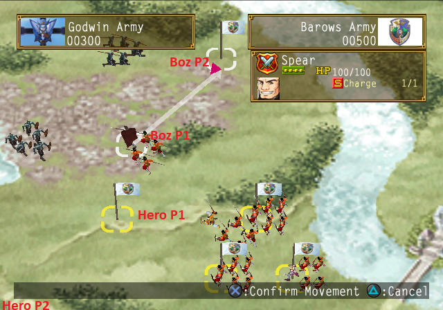

 1. **Boz**: Move to P1
 2. **Hero**: Press R1 to select, move to P1
 3. **Boz**: Once slightly above left tree (as pictured), move to P2
 4. **Hero**: When middle soldier turns southeast, target him. Should be right before Boz kills Archer.
 5. **Boz**: After killing Archer, target middle unit.
 6. **Hero**: After fighting middle unit, move 1 tile above bush in southwest corner.
 7. **Boz**: After killing middle unit, target southwest unit.
 8. **Hero**: When he is about 1/2 a tile below last unit, move prince directly up. Should attack and push unit to Boz.

After results screen 2m25s no input.

### Rainwall
1st floor, 1m25s no input
Exit town.

### World Map
Head to Raftfleet. Can run southwest along the river.

### Raftfleet
Go to Dahak for cutscene, then to Logg's boat.
Logg: "Please! A-A-All right. Please sir!", Lyon: "Prince..." **Option 2**

Talk to Logg 1 Textbox, **Option 2**.
After Option 2 55s then instant textboxes in Wharf.
Leave Wharf.

### World Map
Head to Lordlake. Go east till you can go south, then southeast (slightly more south than east)

### Lordlake
Talk to Talgeyl by entrance.
Leave Lordlake & head to Rainwall.

### Wharf
Logg: "Ya could try goin' back an' then comin' again later..." **Option 2**

### Raftfleet
Don't over mash when Lun leaves party, can talk to Logg again accidentaly.

### Rainwall
Go to Salum's Manse, talk to Salum.
Go to your room.

Leave town, go to Raftfleet.

### Raftfleet
Talk to Logg, 1 textbox then **Option 2**

After load **SKIP BOAT TRAVEL**
After cutscene > conversation > load **SKIP BOAT TRAVEL**.

### Baska Mines
> Optional: Pick **Turtle Orb**, chest closest to Beaver.

#### Mine Shaft
 1. East 1st Fork at entrance
 2. North fork with cart.
 3. East all the way and follow path.
 4. Push next cart and follow cart.
 5. South at fork then west at next fork.

### Dwarf Camp
Talk to Item Shop

<Menu>

##### Buy
2 Jizos

</Menu>

Go northwest.

### Tunnel to Agate
 1. Go straight until you reach open area.
 2. Go northwest in open area.
 3. Right at fork.
 4. Northwest at fork.
 5. North at fork.

### Agate Prison
Pick **Military Uniform** and **Guard Ring** on the way to Lucretia.
Do this menu before 3rd torch on wall after open cell door on screen with Lelei & Cius.

<Menu>

##### Equip
 * Sacrificial Jizo: Hero
 * Guard Ring: Lyon
 * Military Uniform: Lyon
 * Knight Full Armor: Logg
 * 2 Sacrificial Jizo: Lyon
 * Sacrificial Jizo: Hero

##### Items
 * Sort
 * Heal Hero, Lyon, Logg

##### Formation > Rearrange
Lun > Logg

</Menu>

#### Prison Guards
> Guards are in this order: Cius 500HP, Sword 400HP, Crossbow 400HP, Lelei 500HP
> Don't kill crossbow until he kills Logg T2.
> Lun and Logg must die, Hero and Lyon must live.

##### Turn 1
 * Hero: Breath of Ice Scroll
 * Lyon: Dancing Flames Scroll Cius (1)
 * Lun: Defend
 * Logg: Grilled Salmon Hero

##### Turn 2
 * Hero: Breath of Ice Scroll
 * Lyon: Dancing Flames Scroll Cius (1)
 * Logg: Defend

##### Turn 3
 * Hero: Berserk Blow Lelei / Breath of Ice Scroll if Cius lived
 * Lyon: Dancing Flames Lelei

##### Turn 4
 * Auto / Spell to finish Crossbow or adjust to whatever happened.

Lucretia: "So with that understood... Do you still want me to be your tactician?" **Option 2**

<Menu>

##### Unequip All
 * Lun (Maybe not needed)
 * Logg (Maybe not needed)
 * Cius
 * Lelei

##### Unequip
 * Hero: Jizos & Berserk Blow Scroll
 * Lyon: Jizos

</Menu>

Exit through front door.

On boat, Lucretia: "Prince, let's hurry to Raftfleet." > Load > **SKIP BOAT TRAVEL**

### Raftfleet
Go to Dahak.
Lucretia: "Yes, good point.", "Prince, what would you like to do?" **Option 2**

#### War Battle: Intercepting Luger's Fleet
No Setup

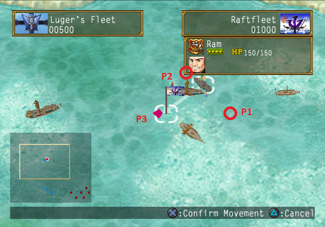

All actions are done with Baz (directly above Dahak)

 1. Move to P1
 2. Right before you reach P1, move to P2 (P2 is 2L2U from P1)
 3. Right before / when the square in Boz's ship & Luger's ship's front sail are vertically aligned, move to P3. Refer to blue crosshairs in image for visual cues.
 4. If done correctly, Luger won't have moved & Boz will automatically attack him again. If not, manually move to Luger's ship.

### Raftfleet
Exit town, automatically back to Rainwall.

> Autohealed somewhere beteen Agate and now.

### Rainwall
Go to inn 2nd floor, pick up **Prosperity Ring**.
Go to Oboro's ship.

Sagiri: "Your Highness.", "Our boss is out of the office at the moment..." **Option 2**

Go to town exit, trigger *leave town* prompt, **do not leave!**
This triggers Oboro, go back to his boat.

Back to Barow's Manse.
Go to your room, Lyon 1 textbox then **Option 2**.
Salum all Option 1. When Lyon joins your party stop mashing so you don't accidently talk to her.

Go downstairs, talk to Salum & Lucretia. Then go back to your room.

Go back downstairs, 1m10s cutscene before option.
Salum: "I think it might finally be time to give the order to go into battle..." Option 1

#### War Battle: Rainwall Defense Campaign
##### Setup
 * Sialeeds: Remove Sialeeds, Lelei. Add Kisara (1D), Lelei (X) Logg  (X)

Kisara's unit is 2 left from Hero's

##### Strategy
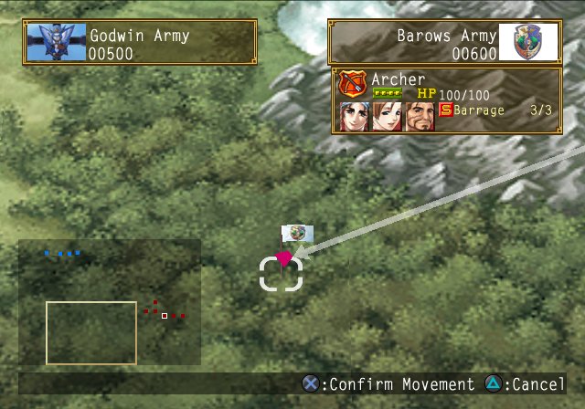

 1. Move Kisara to spot in image. Doesn't need to be precise.
 2. Barrage Jiden 2-3 times.

### Rainwall
Go to Store Room.
Chuck: "If you guys wanna go down there, you'll have to get through me!" **Option 2**

#### Chuck Duel
Special vs Special is 5s faster than Guard vs Special
So if he's not guarding, Special.

| Opponent Dialogue                       | Opponent Action |
|-----------------------------------------|-----------------|
| I don't like picking on the weak.       | Defend          |
| I...I need a little break here...       | Defend          |
| If you won't come at me, I'll go...     | Attack          |
| I'm really gonna pound you, so get...   | Attack          |
| No Way!! You haven't seen the last...   | Special         |
| That was nothing, but you're really...  | Attack          |
| This one's for the young lady!          | Special         |
| Well, c'mon then!                       | Defend          |

Go to basement > wardrobe. 1m50s cutscene, can move instantly afterwards. Run southwest, exit storeroom.

If you haven't already, grab the **Prosperity Ring** in the inn.
Exit town, run to Raftfleet.

### Raftfleet
Go to Dahak meeting room.

Raja: "Well, Your Highness, what should our next course of action be?" **Option 2**

Lucretia: "What do you think, Your Highness?" **Name Army**

> X Start Xx3 is fastest

> From now on, zoom in near Raftfleet entrance for lag reduction.

Go to exit Raftfleet, Dragonhorse cutscene 1m55s before dialogue.

Rahal: "Come on Roog, we're leaving." Option 1

Exit Raftfleet.

### World Map
Head to Lordlake, same path as before.

### Lordlake
Talk to Talgeyl. Go to Clinic. Leave Clinic.

Toma: "Of COURSE that's what I'm saying! How am I..." Option 1
Run back to Raftfleet.

### Raftfleet
Before meeting room, talk to Luserina.

<Menu>

##### Party
 * [1D] Kyle: Party

</Menu>

Dahak meeting room. After cutscene **talk to Raja to unlock Yashuna.**

Go towards Rune Shop, pick up 2 chests straight below Rune Shop for **Sacrificial Jizo** & **Mega Medicine**.
Go to Rune Shop.

<Menu>

##### Buy
 * 3 Lightning Orb

##### Attach
 * Lightning: Kyle
 * Lightning: Lyon

</Menu>

Talk to Logg, go to **Yashuna Village (2D)**.
**SKIP BOAT TRAVEL**

### Yashuna Village
Head east, to northeastern most corner & pick **Prosperity Sandals**.
Back west across stairs then across south stairs and go straight to exit.

### World Map
Head Southeast then south **on road** to Mountain Path.

### Mountain Path
Straightforward. On 2nd screen southwest near start.

### World Map
West along hill, slighly southwest at end.

### Beaver Lodge
Go to Chief's house. 2m30s no input after Toma textbox.
Leave Chief's house. After cutscene head east to exit.

<Menu>

##### Swap
 * Maroon: Entourage

</Menu>

### World Map > Mountain Path > World Map
North until you pass tree on left by road then northwest.
Once you get past hill west, slightly south. Keep going west till you pass top of lake below you, then southwest and south.

### Ceras Lake Ruins
Zweig: "First things first, show me the Dawn rune." Option 1
Lyon: "Prince, let me take care of this." Option 1

#### Lorelai Duel
Special vs Special is .8s faster than Guard.

| Opponent Dialogue                       | Opponent Action |
|-----------------------------------------|-----------------|
| Don't let that swell your head, I'm...  | Special         |
| Hey, aren't you a little too far...     | Guard           |
| Hey, you'll pay for tht! Here comes...  | Attack          |
| Hmm...I guess I'll just warm up a...    | Attack          |
| I can see right through your moves...   | Guard           |
| I guess I'll settle this thing right... | Special         |
| I'm still fine, I can still fight!      | Attack          |
| Not bad, but wait 'til you feel this!   | Special         |
| Unh... you're stronger then I thought!  | Guard           |
| What are you doing? I'm not letting...  | Guard           |
| What did you do, give up? You gotta...  | Guard           |
| What do you think you have to hold...   | Special         |
| You still standing? I'll hit you...     | Attack          |
| You underestimate me...                 | Guard           |

#### Left Side
 1. North at fork
 2. North at fork, press switch.
 3. Back to 1st fork, go south this time and go to next screen.
 4. North at fork, press switch.
 5. Back to fork, west all the way. Press big switch in next room and backtrack to start (all the way east).

#### Right Side
 1. South at fork
 2. North at fork.
 3. North at fork, press switch.
 4. Backtrack to #1, go east this time.
 5. Gotta go both ways here to hit switch, doesn't matter which is first.
 6. Back to #3, east this time. Go to next screen.
 7. North at fork, press big switch.
 8. Backtrack to main room.

Cutscene 1m15 no input.
Do this menu on Suns screen after cutscene (screen after savepoint.)

<Menu>

##### Items
 * Heal party with Mega Medicines

> All Best Kyle?

##### Equip
 * Prosperity Sandals: Hero
 * Prosperity Ring: Hero (over Berserk Blow Scroll)
 * Lightning Amulet: Kyle
 * Jizos onto Hero, Kyle, Lyon in that order if short)
 * Berserk Blow Scroll: Zweig

</Menu>

#### Diamond Sun A (3900HP) & Diamond Sun B (4500HP)
All target Sun A till dead

##### Turn 1
 * Hero: Soaring Bolt
 * Lyon: Soaring Bolt
 * Kyle: Furious Blow
 * Zweig: Berserk Blow / Dancing Flames Scroll
 * Lorelai: Soaring Bolt

##### Turn 2 & on
All use best magic

<Menu>

##### Unequip
All Jizos.

</Menu>

Go to Dawn room, run out after cutscene.

Viki: "It must be fate, us running into each other like this. Would you mind watching over me?" Option 1 (1m10s before dialogue).

### Raftfleet
Dahak meeting room.

Lucretia: "So Prince, what do you think of the plan?" **Option 2**
Lucretia: "Just give the word Prince, and we'll get started right away." **Option 2**

#### War Battle: Hatred Fortress Siege
##### Setup
 * Logg: Remove All
 * Kyle: Remove Luserina
 * Cius: Remove Cius. Add Lelei (1D), Logg (X), Luserina (1D)

##### Strategy
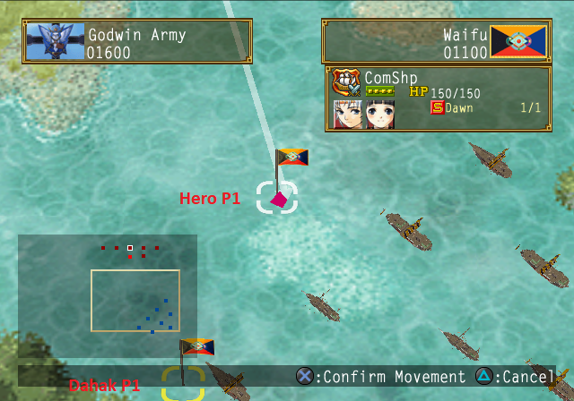
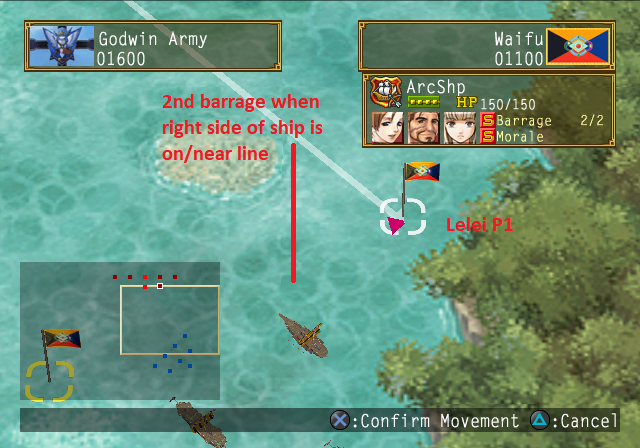

 1. **Dahak**: 1 tile left of leftmost boat. Move cursor down till aligned then tap left twice. Very easy to target ship here which is a big nono.
 2. **(R1) Hero**: Go to P1 (1 tile above 3rd boat 1 tile left of 2nd boat)
 3. **(R1) Lelei**: Go to P1 (2nd image)
 4. **Lelei**: Once top right ship faces northeast, barrage it.
 5. **Lelei**: Barrage ship again when it gets close to the line. If you do it too late, Prince can get Barraged.
 6. **Hero**: Dawn Rune once the rightmost ship has turned northeast and started moving away. Decent cue is it being horizontally aligned with Hero.
 7. **Dahak**: Attack left ship (automatic)
 8. **Dahak**: Barrage left ship.
 9. **Dahak**: Barrage remaining left ship (needs to be facing Northwest). You can do this right before #7.

### Raftfleet

<Menu>

##### Swap
 * Maroon: Entourage

</Menu>

Talk to Viki, TP to **Yashuna (2U)**.

### Yashuna > World Map > Ceras Lake Ruins
Toma: "Hope the signal comes soon." 2m. After load mash though text.
Go to Dawn Room. Zweig: "Ah, it worked!" 2m40s before control.

Go down stairs to Ceras Lake Castle

### Ceras Lake Castle
Zweig: "Headquarters?" 1m45s before textbox with Gizel, Alenia, Zahak
Lyon: "There's only one solution: We'll let the Prince settle this!" **Name Castle** (X Start Xx3)
Go to Tablet room.

Go to basement, talk to Viki for **Blinking Mirror**.
Go back upstairs, exit room from left side by stairs.
After cutscene run southwest and run to Logg. Talk to him once then again and go to Beaver Dam (2U). **SKIP BOAT TRAVEL**.

### Worldmap
Head east then south to Lordlake.

### Lordlake
Cutscene, exit, cutscene, Blinking Mirror.
Teleport to **Beaver Lodge (1U)**.

### Beaver Lodge
Go to Elder's House, talk to Fuwalafuwalu.
Fuwalafuwalu: "So, what can I do for you today?" **Option 2**
Exit to the east, Blinking Mirror.

### Castle
Go to War Room.
Go back to Castle 2nd Floor, exit building south for Taylor cutscene.
Lucretia: "What should we do, Your Highness?" **Option 2**
Go to 1st floor, talk to Luserina.

<Menu>

##### Party
 * [1D] Goesch: Party
 * [1D] Kisara: Party
 * [3U] Zerase: Party

</Menu>

Back upstairs, west exit, talk to Logg to go to **Lelcar (2U)**.
**SKIP BOAT TRAVEL**

### Lelcar
Right after Wasil cutscene go Northeast to pick **White Rose Brooch**.
Then go south, southeast between buildings to pick **Guardian Casque**.
Then southwest to trigger cutscene. Then southwest to Wasil's house.
Go southeast to Eastern Islet, southeast for cutscene.

After cutscene, go to Item Shop.

<Menu>

##### Sell
 * Party Items: Everything but Escape Scroll, Jizos, Mega Medicines, Lightning Crystal
 * Hero: Prosperity Ring
 * Lyon: Guard Ring
 * Zerase: Star Robe
 * [If < 237415 Potch] Kyle: Lightning Amulet and/or Shield Crystal

> Had 245450 in test after selling before Amulet.

</Menu>

Northwest back to Central Islet, northwest to Western Islet. Southwest for cutscene.

#### 3 Bodyguard 800HP & 3 Thug 900HP
Zerase LVL4, rest Defend.

Go downstairs. If you took considerable damage heal with Medicines.

#### 5 Thug 800HP Nikea 2000HP
Zerase Star Rune & Kyle Furious Blow if he still has Lightning Amulet. If not, Kyle & Prince Soaring Bolt.

> 18000 Potch drop base.

Lelei: "What's the plan, Your Highness? There's little time! We..." **Option 2**
Lelei: "Whenever you're ready, please issue the order to commence operations." **Option 2**

#### War Battle: Lelcar Campaign
##### Setup
 * Logg: Remove All
 * Kisara: Remove All
 * Cius: Remove All. Add Kisara (1D), Logg (X).

##### Reward
$15000, Guardian Chain

##### Strategy
All Actions are Kisara. Starts bottom-left of Hero.
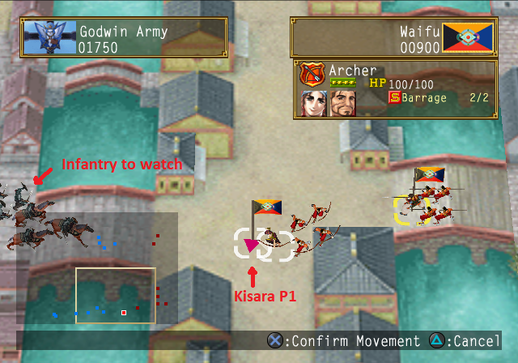

 1. Move to P1 (directly left). Must be done quick!
 2. As soon as in Barrage range, Barrage Cavalry. Good visual marker is instantly as soon as infantry starts turning southeast. DO NOT LET INFANTRY REACH BRIDGE.

### Lelcar
> Get autohealed after War Battle.

##### 6 Godwin Soldier 1000HP
Zerase LVL4, rest Defend. Drops 13050 base, 14355 with Prosp. Sandals.

Head **Northwest**, trigger cutscene. If you get a battle Star LVL4.
Lelei to Entourage.

Go to Rune Shop.

> I had 308135 Potch here, 8035 after Rune Shop.

<Menu>

##### Equip
 * Lightning: Kisara
 * Shield (if not sold): Kisara

##### Buy
 * Double-Edged Orb x2

</Menu>

Go south east through islets to get to World Map & Blinking Mirror

> On PCSX2, taking boat back was about 2s faster. Need to test on PS2.

### Castle
Go to War Room. After Cutscene, go to 1st floor.
Talk to Mirror to TP **Lordlake (X)**.

### Lordlake > World Map
Go east then southeast.

### Sable Checkpoint
#### Sable Patrol Guards 1200HP
Lyon Soaring Bolt, Zerase LVL4.

Dinn & Boz to Entourage.

Optionally, Swap Dinn and Sialeeds for party wipe safety. If you do swap, swap back before Faylen & Faylon fight.

### World Map
East, Southeast below bolder, east till road, southeast a bit then east again.

### Sable
> LCC's notes say pick **Elementary Magic** in Lord Raubel's Courtyard.

After cutscene go to inn, rest, then head to Ranro Mountain.

### World Map
Go around 1st boulder, slightly northeast then east.

### Ranro Mountain
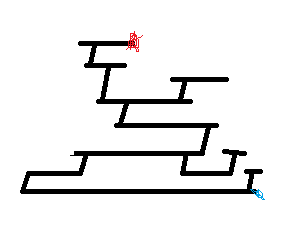

 1. Go west and up vine.
 2. East and up vine.
 3. East and up vine.
 4. West and up vine.
 5. West and up vine.
 6. West and up vine.
 7. East

#### Faylon 2000HP Faylen 1800HP Bandit 1200HP
##### Turn 1
 * Lyon: Soaring Bolt
 * Kisara: Furious Blow
 * Zerase: Star LVL4
 * Viki: Furious Blow

> Want Sialeeds to live here for EXP, want a LVL4 spell
> Only need 1 Furious Blow, 2nd one is safety / SPD.

Enter left room. 2m35s before dialogue.
Roy: "Then I get to take your place as prince!" Option 1

#### Roy Duel
> Watch out for super move at <50% HP
> Guard is .5s faster than Special.

| Opponent Dialogue                       | Opponent Action |
|-----------------------------------------|-----------------|
| Ah ha ha ha! Here, have another one!!!  | Special         |
| All right, this one is gonna put you... | Special / Super |
| And now for the feint...This'll do...   | Attack          |
| C'mon, what's the matter? I'm nowhere.. | Attack          |
| Damn it!! Just try that again!!         | Attack          |
| Damn you, that really hurt!!            | Attack          |
| D-damn you... You really got me...      | Guard           |
| Grrrrr!! You really piss me off, you... | Special         |
| Hmmm. Maybe I'll hit you with my best.. | Special         |
| Hmph. How 'bout if I really get...      | Special         |
| Hmph. If this ends things, how boring.. | Guard           |
| Hmph. Think that'd hurt me? Come at...  | Guard           |
| Hmph. Think that'd hurt me? You gotta.. | Special         |
| How'd you like that? I'm gonna make...  | Special         |
| I don't feel like having some kind of.. | Special         |
| I'll be able to handle it next time!!   | Guard           |
| Is that the best you can do?! Well...   | Attack          |
| It's no fun if we both use nothing...   | Attack          |
| Let's hit each other with our best...   | Special         |
| Okay, here comes another one!! ...Nah,  | Guard           |
| Tsk. It's like looking at my own face.. | Attack          |
| Tsk tsk tsk! What a loser!              | Guard           |
| Well, I'm not gonna hit you with my...  | Attack          |
| What are you waiting for? Come at me!   | Guard           |
| What is this, an endurance contest? ... | Guard           |
| Y-you got me... I gotta take a break... | Special         |

Roy: "I was ready to die from the start, anyway! C'mon Prince! ..." **Option 2**
Add Bandits to Entourage. Use **Escape Scroll** to exit Ranro Mountain.

### World Map
West, southwest at boulder.

### Sable
Go to Raubel's house and go upstairs.

> All autohealed before & after	Euram fight.

Dinn: "Yes my lady! I shall not fail you!." 2m10s before battle start.

#### Euram 800HP & 5 Bodyguard 1000HP
 * Hero: Soaring Bolt
 * Lyon: Soaring Bolt
 * Faylen & Faylon: Co-op Bodyguard #2
 * Sialeeds: Funeral Wind

Go to Raubel's house.

> Recruiting Faylen & Faylon costs ~16s here.

Solis: "I must offer you my sincere gratitude, Prince." **Option 2**

Add Dinn, Boz, Roy to Entourage.
Exit Sable, Blinking Mirror.

### Castle
Go to War Room. Then go to your room.
Lyon 1 Textbox Option 1.

Go to 1st floor, talk to Luserina.

<Menu>

##### Party
 * [4U] Kyle: Party
 * [3D] Kisara: Party
 * [1R1D] Zerase: Party

</Menu>

Can TP or run from castle. Odds of battle are lower from castle.
Assuming no battle, TP is 14s faster. A 1st try retreat also costs ~14s.

If TP, Viki 2 Textboxes then **Option 2**.
If run, go back to 2nd floor and exit from left. Then run down stairs and back around to right side.

### Beaver Lodge
#### Assassin 1800HP
If Lightning Amulet: 1st one Kyle Furious Blow & Zerase LVL3
Otherwise, Kyle Soaring Bolt, Zerase LVL3, Kisara Berserk Blow

If needed, heal. Head to Chief's house.
If you haven't gotten it already, force another **Assassin battle**.
If Lyon is < 170HP, heal her. Dolph always attacks her.
Enter Chief's house.

#### Dolph 3000HP
 * Hero: Soaring Bolt
 * Lyon: Defend
 * Kyle: Furious Blow / Soaring Bolt
 * Kisara: Furious Blow
 * Zerase: Comet
 * Maroon: Defend

Go outside. Goesch and Toma to Entourage.

> All autohealed here.
> CTW unequipped Lightning Amulet here in Suikothon. For selling later?

Exit East & Blinking Mirror.

### Castle
Go to War Room.

Boz: "What do ya think, Prince?" **Option 2**
Luserina: "It's alright, I understand." 2m55s no input.

Go to War Room.
Go to 1st floor, talk to Luserina.

<Menu>

##### Party
 * [1D] Dinn: Party
 * [2D] Faylon: Party
 * [2D] Goesch: Entourage

</Menu>

Talk to Mirror, TP **Haud Village (1D)**.

### Haud Village > World Map
Head southeast, roughly following road. Once past bridge head southeast.

### Estrise
Talk to Appraiser. Appraise & Sell **"The Sacred Games"**

Run past appraisal shop, then go right.
Go all the way southeast, pick **True Men Tactic**.

On the way back, talk to Armor Shop.

<Menu>

##### Sell
 * All Party Items **EXCEPT**
 * Escape Scroll
 * Jizos
 * Crazed Orbs
 * Double-Edged Orbs
 * Firefly Orb
 * Master's Robe (why?)

</Menu>

Go back left then up, talk to Rune Shop.

<Menu>

##### Equip
 * Double-Edged: Dinn Left Hand (Bottom Slot)
 * Double-Edged: Faylon Left Hand (Bottom Slot)
 * Firefly: Georg
 * Crazed: Dinn over Titan
 * Crazed: Faylon Right Hand

</Menu>

Go upstairs to dock.

Boz: "Good luck..." 1m20s no input.

### Nirva Island
Skald: "Skald Egan, Admiral of the Island Nations Federation fleet." **Option 2** 1m35s no input after.

Head west, up stairs, northwest then north to next screen.
Go to Blacksmith on the left side.

<Menu>

Costs ~132000 for 2 LVL10
##### Sharpen
 * Dinn: 10
 * Faylon: 10
 * Goesch: As much as you can, ideally at least 7

</Menu>

Leave blacksmith, northeast up stairs then east to lighthouse.

Lyon: "Prince, what do you think?" **Option 2**
Bernadette to Entourage.

<Menu>

##### Equip
 * Jizos onto Dinn, Faylon, Goesch in that order(?)

</Menu>

Enter Lighthouse, go slightly northeast and follow staircase.
Before final stairs pick **Striking Tactic** from bottom right chest.

Lyon: "I'll climb the ladder, then." **Option 2** (For -Georg Affection.)

Exit lighthouse, go to ladder and follow all the way up.

> To climb ladders, talk to them with X and hold up.

#### 5 Pirate Lackey 1500HP  1 Pirate Captain 2200HP
Formation > Rearrange: True Men (2D)
Formation Skill

Go back down Lighthouse.

Talk to guy by dock to go back to Estrise, 1 Textbox then **Option 2**.
After next textbox 1m no input.

### Estrise
Talk to Item Shop

<Menu>

##### Sell
Sell from bottom until you sell Titan Orb.

##### Buy
9-12 Jizos depending on how many we had left. (had 106k here)

</Menu>

Talk to Rune Shop.

<Menu>

##### Unequip
 * Lyon: Lightning

##### Equip
 * Lightning: Bernadette RH

</Menu>

Exit town & Blinking Mirror

### Castle
Go to War Room.

Lucretia: "We're in for some rough times ahead." 1m55s no input.

Go to War Room.
Lucretia: "Prince, if you had to raise a sword against your sister, ..." Option 1

Go to War Room. Lucretia 1 Textbox **Option 2**

#### War Battle: Doraat Siege
No setup.

Only Prince moves in this fight.
##### Strategy
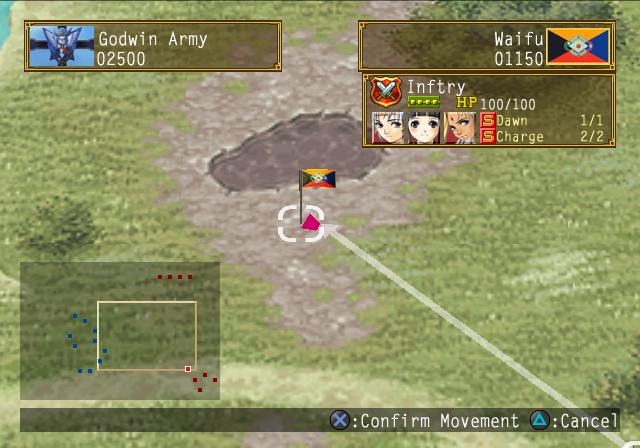
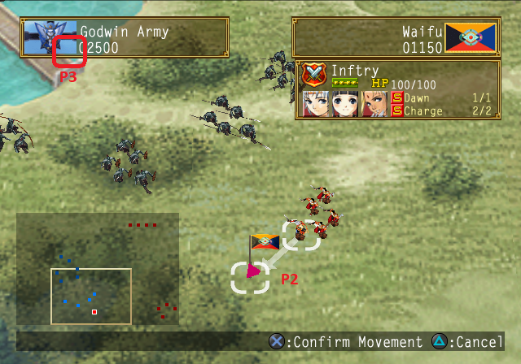

 1. Move Northwest to center tile right below lake (1st image).
 2. When almost there, move to P2
 3. When around the spot where Prince is in 2nd image, move to P3.
 4. After Twilight Rune scene move into Fortress

### Doraat
Talk to Luserina.

<Menu>

##### Party
 * [2D] Dinn: Party
 * [3D] Faylon: Party
 * [3D] Goesch: Party
 * [] Bernadette: Entourage

</Menu>

<Menu>

##### Equip
 * Zerase: Master Robe, 1 Jizo
 * Faylon: 3 Jizos
 * Dinn: 3 Jizos

</Menu>

Open door, head straight along road to Fortress.

All Battles: True Man
Heal after all with Bernadette Kindness Rain

#### Alenia 2700HP 5 Godwin Soldiers 1500HP
True Men. Looks like you want all alive for Alenia kill. But if she survives Striking Arrow.

Heal after battle if needed. Any battles you see use True Men.

1m45s no input after battle.

Enter northeast door. Northeast door and pick bottom chest for **Blinking Rune Piece**.

> Consider skipping this and picking it up in Ashtwal Mountains instead.

Exit room and take southeast stairs.

Do this menu before Miakis duel.

<Menu>

##### Equip
 * Faylon: 3 Jizos
 * Dinn: 4 Jizos

</Menu>

Lyon: "But Miakis!" Option 1, 50s before option, 35s before duel start after.

#### Miakis Duel
Special vs Special is .8s faster.

| Opponent Dialogue                       | Opponent Action |
|-----------------------------------------|-----------------|
| All right, Prince. Show me how good...  | Attack          |
| All right, no time to recover!          | Attack          |
| Big moves like that tend to create...   | Guard           |
| Come on, you can do better than that!   | Attack          |
| Didn't I ask you not to hold back?      | Guard           |
| Don't you want to settle this quickly?  | Special         |
| Hey that really hurt! Are you trying... | Guard           |
| Hey, that really hurt! Now you're going | Attack          |
| I guess I ought to be a little more...  | Guard           |
| I guess you are a boy, after all. Now.. | Attack          |
| If you don't start getting serious, ... | Special         |
| No! I won't give up yet!!               | Attack          |
| Now I'm going to get really serious!    | Special         |
| Oh, my... Are you all right?            | Guard           |
| Okay, here I come!                      | Attack          |
| Ouch, that hurt!! I'll get you this ... | Special         |
| Ow, ow! Now it's my turn!               | Attack          |
| Ow, ow, ow! You've really got your...   | Guard           |
| Phew! I feel a little tired...          | Guard           |
| Phew! My arm is tired.                  | Guard           |
| Prince, can you handle this one?        | Special         |
| Prince, let's put an end to this!       | Special         |
| So that's the way you like it, huh? ... | Guard           |
| Think you can withstand it this time?   | Special         |
| Time for you to go beddy-bye!           | Special         |
| What do you think of this, then?!       | Special         |
| You'd better stop dawdling or little... | Attack          |

Last action of duel > textbox is 1m10s

### Castle
Go to Tablet Room, talk to Zerase.
Zerase: "Now that the Twilight Rune has been used, we must quickly--" 2m35s no input.
Downstairs, cutscenes, Castle upgrade.

Alenia: "*sigh* I will always do what is in the best interest of my nation..." 2m15s no input.

Go to War Room.

Lucretia: "Okay, let's build on this group. Who else would you like to accompany Roy and Zerase?"

<Menu>

##### Roy's Party
 * [1R1D] Lorelai
 * [] Bernadette
 * [3U] Kisara

##### Kyle's Party
 * [3U] Lelei
 * [] Cius
 * [?] Faylen
 * [1U] Zweig
 * [] Dinn

##### Hero's Party
 * [?] Goesch
 * [] Faylon

</Menu>

Go to your room, talk to Maid. Option 1
Maid: "Pleasant Dreams!" 1m55s no input

#### War Battle: New Queen's Campaign
No Setup. All movement is Roy.

##### Strategy
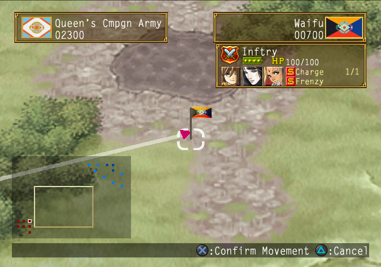
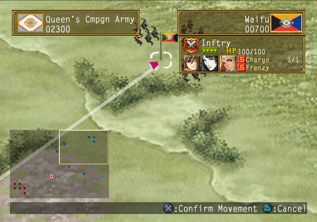

 1. Move to tile in image 1.
 2. When close/on tile #1, move to tile in image 2 (1 tile DR Alenia.) 1 Tile below Alenia works too.

#### Alenia 2800HP 5 Elite Soldier 1200HP
##### Turn 1
 * Roy: Defend
 * Zerase: Meteor
 * Lorelai: Soaring Bolt
 * Bernadette: Soaring Boalt **(NOT SILENT LAKE)**
 * Kisara: Soaring Bolt
 * Viki: Soaring Bolt

##### Turn 2
 * Zerase: Comet
 * Rest: Soaring Bolt **(NOT SILENT LAKE STILL)**

#### Zahak 2500HP 5 Elite Soldier 1200HP
##### Turn 1
True Men

##### Turn 2
Striking Arrow

Galleon: "I shall faithfully fulfill that duty! I must protect the Queen!" **Option 2**

#### Galleon 2800HP 5 Elite Soldier 1200HP
##### Turn 1 & 2
True Men

##### Turn 3
Striking Arrow

Lym: "... If you don't stop...you'll make me cry too! Oh, I knew you'd come!" 1m35s before option.
Miakis" You've GOT to be joking!" Option 1

Miakis: "No, We have to save her!" 1m35s no input.

### Castle
Go to your room.
Ferid: "Your Majesty! You can't mean..." **6 Minute Break**

Galleon: "You may trust him with your life, Your Highness!" 1m45s no input.

Go to infirmary. Go to tablet room. Go to War Room.

Lucretia: "However, this decision is in His Highness' hands." **Option 2**

Go to 1st floor. Talk to Luserina.

<Menu>

##### Party
 * [2D] Dinn: Party
 * [3D] Faylon: Party
 * [3D] Goesch: Entourage

</Menu>

Go southeast to go outside for Galleon cutscene, Galleon to Entourage.

> Have to leave Castle for Logg (and Viki) trigger which requires fighting Byakuran.
> On PCSX2, going right and Mirroring is 1s faster. It is probably slower on PS2 though due to more loads. But you get the sick Snake Flight if you go right.

> CTW Swaps in Galleon and Goesch here, I don' think it's worth it since you kill regardless and EXP is negligable.

#### Byakuran
Striking Arrow (should already be in formation)

Right Path: Exit to WM, Mirror, exit 1st floor southeast, run southwest across bridge and follow path.
Left Path: Run back downstairs, west, and refer to above. Run past Logg to the west, enter Ceras Lake Ruins screen and run back to Logg.

Talk to Logg, select **Port Spinacks (1U)**.
**SKIP BOAT TRAVEL**

### Port Spinacks
South, up 2nd stairs, south slightly west. Talk to guy by save crystal near southwest exit. Backtrack to boat.
Talk to Assistant Option 1, 1 Textbox **Option 2**.
**SKIP BOAT TRAVEL**

### Hershville Naval Base
Northwest up stairs, pick top right chest for **Blinking Rune Pc**.
Southwest down stairs, north west towards ramp, north east to Cathari.
Talk to Cathari.
Back to boat, talk to Assistant Option 1 Textbox **Option 2**.
**SKIP BOAT TRAVEL**

### Port Spinacks
Southwest up stairs, south, southeast, Cathari cutscene.
After fade out & first option, Cathari: "I mean, a nice prince. Prince Hero." **Option 2**
Cathari to Entourage, then menu.

<Menu>

##### Swap
 * Miakis: Goesch
 * Zweig: Galleon
 * Lorelai: Cathari

> If not many fights taken in Doraat, consider moving SP off Hero. 2 should be enough.

##### Skills: Equip
 * Goesch: Slot 1 > Attack
 * Cathari: Slot 1 > Attack
 * Faylon: Slot 1 > Attack

</Menu>

**Congratulations, you can run now! Hold L2 to run anytime Cathari is in your party.**

Exit to the south east, Blinking Mirror.

### Castle
Go to War Room, talk to Lucretia.
Cathari: "That is why I want to... assist you." **Option 2**
Go to 1st floor, TP to **Port Spinacks (2U)**.

### Port Spinacks
Exit southeast to Worldmap

### World Map
Southeast to Sauronix Castle

### Sauronix Castle
Enter Castle. After cutscenes talk to Combat Tutor.

<Menu>

##### Tutor
 * Cathari, Goesch, Dinn, Faylon: Attack - C

</Menu>

Exit Sauronix, run back to Port Spinacks.

### Port Spinacks
Talk to Item Shop

<Menu>

##### Sell
 * Junk (not paintings)
 * Guardian Scarf
 * Spun Silver Armor
 * Rage Sword Orb
 * Howling Orb

> This needs to be reviewed.

##### Buy
 * Goesch: 2 Jizos
 * Dinn: 4 Jizos
 * Cathari: 4 Jizos
 * Faylon: 4 Jizos
 * Inventory: 12 Jizos

</Menu>

Exit Spinacks to Southwest.

### World Map
Head northwest above forest then west slightly south

### Twilight Forest
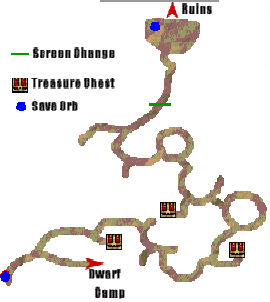

Directions here are denoted using clock hand directions.

 1. North from savepoint, east at first fork. Hold northeast.
 2. After turn north hold northeast.
 3. Go south at fork, hold southeast to follow arc.
 4. At 6 o'clock go south. Go southeast > northeast around arc.
 5. At end of arc go north then northwest on next arc.
 6. At about 10 o'clock go northwest then west. Follow arc northwest.
 7. At about 10 o'clock go northwest to transistion to next arc.
 8. Go southwest, northwest, southwest again.
 9. Once you can go northwest, then go northeast and follow path.

### Twilight Forest Ruins
 1. East at fork.
 2. South at fork.
 3. West at fork (grassy area & chest here as indicator).
 4. Pick up chest at fork for **Cape of Destiny**, go east then north at forks.
 5. Cutscene next screen. Pick both chests for **Guardian Gloves** & **Fujiwara Gauntlets**.
 6. East at fork, then north at fork.
 7. West at fork. (Both path's are same speed here, west is just easier to give directions for.)
 8. East at fork then north at fork (savepoint).

Zweig: "Give it a try, Prince." 45s no input.

#### Ancient Creeper 5000HP
True Men does about 2400, Striking Arrow about 2100.
2 True Men, 1 Striking Arrow.

> With Goesch sharpen in Estrise, can maybe 2T here.

Miakis: "The Twilight Rune..." 2m30s no input.

Escape Scroll, south to exit ruins. Then Escape Scroll again and south to leave forest. Blinking Mirror.

### Castle
Go to infirmary. 1m30s no input.
Go to 1st floor, talk to Luserina.

<Menu>

 * [2U] Goesch: Party
 * [1D] Cathari: Party
 * [3D] Faylon: Party
 * [3D] Galleon: Party

</Menu>

Go to infirmary, Lun to Entourage. Go to War Room.
Exit War Room, Logg to Entourage.
Go to 1st floor, TP **Dwarf Camp (3D)**.

### Dwarf Camp
Gunde to Entourage.

> If I grab Golden Hammer and talk to Dungo, I should be able to sharpen to 15 here. ~12.67s cutscene though, make sure you get Wabon first.

Talk to Wabon. Wabon to Entourage.
Talk to Cart.

### Tunnel
#### 2 Assassins 2500HP
True Men

West to carts.

#### Raging Assassin 3500HP
True Men ~2k then Striking Arrow ~1.8k

### Twilight Forest
Exit Southwest. Head to Sauronix.

### World Map > Port Spinacks > Sauronix Castle
Watch cutscene, run back to Twilight Ruins

### World Map > Port Spinacks > Twilight Ruins
Cutscene, end up in Sauronix

### Sauronix
Go east, talk to Appraiser.

<Menu>

Appraise & Sell all

</Menu>

Talk to Rune Shop.

<Menu>

##### Unequip
 * Faylon: Double-Edged

##### Equip
 * Crazed: Cathari
 * Crazed: Goesch
 * Double-Edged: Cathari

</Menu>

Enter Sauronix Castle, go to top floor.
Go to Craig's Office.
Talk to Combat Tutor.

<Menu>

##### Train:
 * Goesch, Cathari, Faylon: Attack - C

</Menu>

Go all the way back downstairs.
Talk to Item Shop.

<Menu>

##### Sell
 * Party Items: Everything besides Jizos and Blinking Rune Pcs
 * Roog: All Armor
 * Rahal: All Armor
 * Galleon: Sun Badge

</Menu>

Go to Blacksmith.

<Menu>

##### Sharpen
 * Goesch: 12
 * Cathari: 12
 * Faylon: 12

> Had 180k left after.

</Menu>

Go back to southwest, cutscene, Blinking Mirror.

### Castle
Go to War Room.

Lucretia: "I'll dispatch the necessary troops. Which force will Your Highness take command of?" **Option 2**

#### War Battle: Lordlake Defense Campaign
##### Setup
 * Zerase: Remove All
 * Galleon: Remove All, Add Zerase (1U), Cathari (1R2D)

All movements are with Zerase. Zerase is top right unit.
##### Strategy
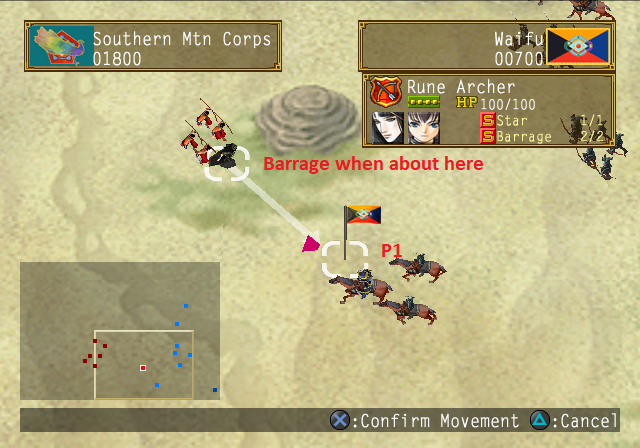

 1. Move to P1
 2. Barrage Jiden.
 3. Star Rune Jiden. Should be in range when he's northish.

### Castle
#### EXTREMELY IMPORTANT OPTION HERE
Lucretia: "What do you think, Your Highness?" **Option 2**
Next 2 Options Option 1

Gizel: "Is that so? I hope your faith is not misplaced." 1m10s no input.

#### War Battle: Final Defense Campaign 1
##### Setup
 * Zerase: Remove All
 * Boz: Remove All, Add Zerase (1L1U), Talgeyl (X), Cathari (1R1D)
 * Goesch: Remove All
 * Bernadette: Remove All

Can use R1 x2 to select Zerase
##### Strategy
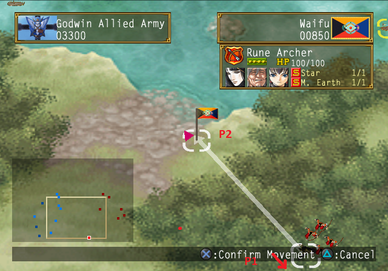
 1. Hold directly down left to move to P1
 2. About 1 tile before P1, move to P2
 3. When close to P2, move directly down left.
 4. When past infantry but still above Jidan vertically, move to tile right infront of or behind Jidan.
 5. Fight Jidan, Mother Earth Rune.
 6. Instantly after battle Star Rune.

### Castle
Raja: "It's a trap.", Lucretia: "That it is." **Option 2**

#### Roy vs Childerich Duel
Guard is ~1s faster than Special

| Opponent Dialogue                       | Opponent Action |
|-----------------------------------------|-----------------|
| Deadlock, eh? Take all the time you...  | Guard           |
| Deadlock, eh? Then let me break it!     | Attack          |
| Don't make me laugh! That pitiful...    | Attack          |
| Don't make me laugh! This is how you... | Special         |
| Grrrrr...Damn you...                    | Guard           |
| Ha ha ha ha ha! Are you done?           | Guard           |
| Ha ha ha! There's more where that...    | Attack          |
| Ha ha ha... You start first.            | Guard           |
| Ha ha ha... You sure you're ready?      | Special         |
| Ha ha ha...All right, here I come.      | Attack          |
| Ha ha ha...Allow me to reunite you...   | Special         |
| Ha ha ha...Pathetic performances like.. | Guard           |
| Hmph. Guess you're not as weak as you.. | Guard           |
| Me, Injured...? I'm gonna make you...   | Special         |
| Me, Injured...? You're not getting...   | Attack          |
| Why, you little brat!! Die!!            | Special         |
| Why, you little brat!! I'll put you...  | Attack          |
| You tired already? Need a little break? | Guard           |
| You tired already? What fun is that?!   | Attack          |

After last action 2m30s no input.

#### War Battle: Final Defense Campaign 2
No Setup. This fight is horrible if you mess up. Have to try to recover with other Dragonhorse unit.

General strategy is to zigzag between ships to Childerich and lock him in bottom right corner. Want to make sure you attack him from top left, otherwise might get barraged by archers.

R1 x4 to select Craig. All movements are Craig.
##### Strategy
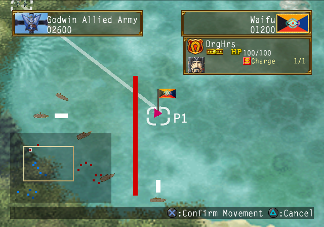

 1. Move to P1
 2. When S1 is has turned from southeast to east, move to P2
 3. Once you pass S1 and are about 1 tile left of Childerich, move to P3
 4. When close to Childerich, target him or tiles below him.

### Castle
Northeast, enter castle from left side. Go to War Room.

Lucretia: "Who would you rather fight, Your Highness?" **Option 2**

#### War Battle: Armes Pursuit Battle
No Setup

Prince movement only
##### Strategy
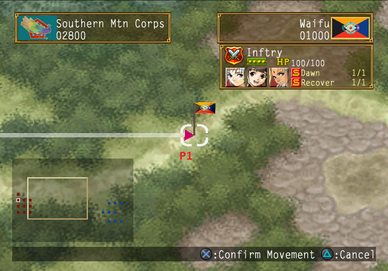
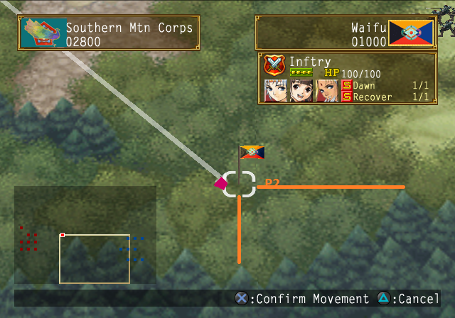
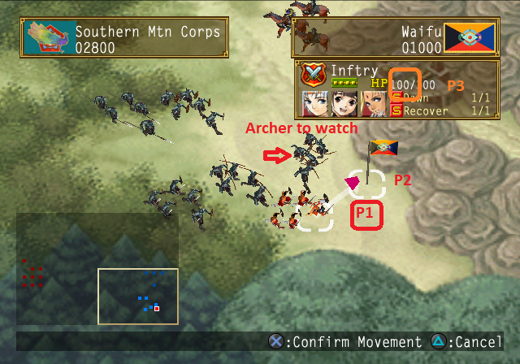
 2. When Prince is on road, move to P2
 3. Right before you reach P2, move to P1 in 3rd image (want to be standing on orange horizontal line).
 4. When the archer turns south you past it to the right, move to P2 in 3rd image.
 5. Once about horizontally even with archer, move to P3 in 3rd image.

### Sable

<Menu>

##### Party
 * [1U] Goesch
 * [2U] Georg
 * [4D] Faylon
 * [1D] Cathari

</Menu>

> Can still get battle in inn, doesn't work to try to skip battle.
> Crown of Destiny here sells for 15k. Shouldn't ever be worth it.

Jidan: "No one makes a fool of General Jidan Guisu!" **Option 2**

#### Jidan 3500HP 5 Armes Bodyguard 2000HP
True Men

### Castle
> Can grab Cathari before War Room, timing is really close both ways.

Go to War Room.
Lucretia: "What do you think, Your Highness?" **Option 2**

Go to 1st floor, talk to Luserina.

<Menu>
[1D] Cathari: Entourage (faster, doesn't matter)
</Menu>

TP to **Yashuna Village (1R1U)**.

### Yashuna Village
Northeast to inn. Upstairs, southeast room.
Cius: "Your Highness, allow me to go first!" 55s no input.
Leave town & Blinking Mirror.

### Castle
Go to War Room.

#### War Battle: Stormfist Siege
No Setup

Prince moves only.
##### Strategy
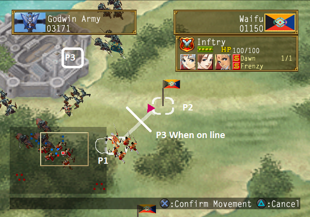

 1. Move to P1 (directly up left)
 2. [Shoon] When Cavalry gets close to Shoon, move 4-5 tiles southeast.
 3. When almost at P1, move to P2 (2 right 2 up)
 4. When about halfway point between P1 & P2 move to P3

### Western Woods > Stormfist
<Menu>

##### Party
 * [3D] Dinn: Party
 * [1D] Cathari: Party
 * [2U] Goesch: Entourage
 * [3D] Faylon: Entourage

Once you regain control.
##### Swap
 * Zerase > Goesch
 * Shoon > Faylon

##### Equip
 * Goesch, Faylon, Dinn, Cathari: 4 Jizos

</Menu>

Head through Underground Passage. In Basement go south through broken cell door and upstairs to Infirmary. From infirmary go to Arena. As soon as you enter Arena 1m40s no input.

#### Hero vs Childerich
Special is .6s faster than Guard. Care for Super after 50%.

| Opponent Dialogue                       | Opponent Action |
|-----------------------------------------|-----------------|
| Gah!!                                   | Attack          |
| Gaaaahh!!                               | Special / Super |
| Gunh Gunh Gunh Gunh...                  | Guard           |

Northeast, up stairs to next screen. On entrance, don't go too far down or you'll trigger Zerase text. Northeast to Godwin Castle.

##### Dilber 3800HP & 4 Imperial Guard 2000HP
True Men

1m25s no input after battle. Go northeast and enter Castle.

### Godwin Castle
If battle True Men.

 1. West at fork and follow Red Carpet. Northeast at fork, go upstairs.
 2. Southwest, 2nd door (Gizel's Room)

Sialeeds: "Oh by the way, is Lyon okay?" Option 1

#### Sialeeds 3500HP
Striking Arrow

After EXP Screen 1m30 no input.
Go back downstairs, east to trigger cutscene.

Go up east stairs then first east door. Cutscene, then back downstairs.

### Castle
Go to 1st floor, talk to Luserina.

<Menu>

##### Party (Party/Entourage doesn't matter)
 * [1U] Galleon
 * [1U] Georg
 * [1U] Goesch
 * [3U] Faylon
 * [1D] Cathari
 * [2D] Dinn

</Menu>

TP **Lelcar (1R1D)**.

### Lelcar
Southwest to Item Shop.

<Menu>

##### Sell
 * All Party Items EXCEPT Jizos & Blinking Rune Pcs

##### Buy
 * 4 Jizos for all in party (3 Prince)
 * Jizos to Party Items until 20

</Menu>

Go Southwest to Western Islet, then Northwest for Rune Shop.

<Menu>

##### Buy
 * 3 Double-Edged Orb (2 if one from Georg is cut.)

##### Equip
 * Double-Edged: Georg, Goesch, Faylon
 * Firefly: Galleon

</Menu>

Go into Skills Menu.

<Menu>

##### Equip
 * Georg: Attack

</Menu>

Go slightly soutwest then northwest to exit Lelcar & Blinking Mirror.

### Castle
Go to Prince's Room, 2m5s no input.
Go to War Room.

Go to infirmary.
Silva: "I guess I'll check on my other patients." 1m no input.

Go back to 1st floor, exit building southeast. Go southwest across bridge for Georg cutscene.

Go back, up west stair then east entrance.
Talk to maid by your room. 1 Textbox, **Option 2**

Go to War Room.
Raja: "It'll be my pleasure to deliver the first blow!" 1m5s before Option.
Lucretia: "If you would, Prince?" Option 1

#### War Battle: Sol-Falena Siege Part 1
No Setup

Only move Dahak.
##### Strategy
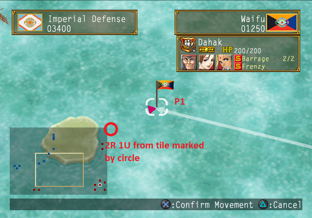
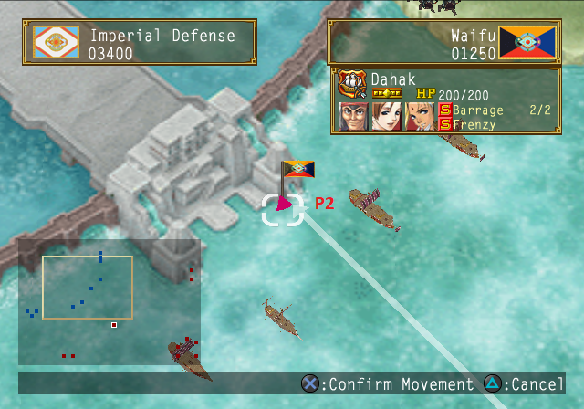

 1. Move to P1.
 2. When close to / at P1 move to P2. No harm in waiting for Dahak to stop moving if you want to be safe.

### Dahak
Go east, down stairs. Talk to Luserina.

<Menu>

##### Party
 * [1R] Goesch
 * [1D] Cathari
 * [3D] Faylon

</Menu>

Leave Dahak.

#### Sialeeds 4000HP
Striking Arrow

Godwin Soldier: "As you wish, my lady!" 2m30s no input.

Lucretia: "Yes, I know... We're not out of the woods yet." 2m45s until Option.

Lucretia: "...And I want YOU to take command of this operation, Prince." Option 1 then 3m5s no input.

#### War Battle: Sol-Falena Siege Part 2
##### Setup
 * Fuwalafuwalu: Remove All

##### Strategy
 1. [Hero]: Move to P1 (2 Up from starting tile)
 2. Move other 5 units to bottom right corner, watch Hero's unit. There is no need to rush this.
 3. [Hero]: Once Hero is standing on line on bridge, move to P2.
 4. [Dahak]: Watch east ship on left side, once it starts turning east, move Dahak like 20 tiles directly northwest. Can press R1 till Shula, then move Camera around. Next R1 will be on Dahak.

### Sol-Falena
Talk to Luserina.

<Menu>

##### Party
 * [3U] Faylon: Party
 * [1R] Goesch: Party
 * [1D] Cathari: Party
 * [2D] Dinn: Entourage

##### Swap
 * Lyon > Dinn

</Menu>

Northeast to Palace.

#### Alenia 3000HP & Zahhak 3300HP
True Men

> Note: Without Faylon still hit Zahhak for 5500 here. Can skip Swap if we don't care about EXP.

#### Raging Alenia 4500HP & Raging Zahhak 5000HP
True Men

Northeast to Audience Chamber. After entering 3m45s no input before duel start.

#### Gizel Duel
Special .8s faster.

| Opponent Dialogue                       | Opponent Action |
|-----------------------------------------|-----------------|
| A weak attack like that would never...  | Guard           |
| All right, Prince, what do you think... | Special         |
| And here's another one for you!         | Attack          |
| First of all, let's see how you...      | Attack          |
| Heh heh heh...A little bit of tension.. | Guard           |
| How about it? Think you can stop that.. | Special         |
| I think I felt that one a little bit... | Guard           |
| I'd like for you to show me some of...  | Guard           |
| I'm not finished with you yet!          | Attack          |
| It looks like we both were a little...  | Attack          |
| Let me see what you can do.             | Guard           |
| Let me show you how a big move is...    | Special         |
| Let us calm things down a bit.          | Guard           |
| Looks like that wasn't quite enough...  | Attack          |
| Please don't disappoint me.             | Guard           |
| That was just a flesh wound now it's... | Attack          |
| This is just a waste of time. Now...    | Special         |
| This time, I'll really finish you off!  | Special         |
| This time, why don't you make a move?   | Guard           |
| This won't get us anywhere. Take this!  | Attack          |
| Time to finish you off!                 | Special         |
| Very nice, Prince. But our battle has.. | Attack          |
| Very nice, Prince. Maybe I should be..  | Guard           |
| Very nice, Prince...But it's not over.. | Attack          |
| Very nice...But do you think you can... | Special         |
| Very nice...Now I'll show you what I... | Special / Super |
| Why don't you try a steadier approach?  | Attack          |
| You should have shown me a move at...   | Special         |
| You wouldn't let yourself get defeated..| Special         |
| Your Highness, you leave yourself...    | Guard           |

2m10s from last action to text.

Leave Sun Room. Go to Audience Chamber. Leave Audience Chamber, talk to Luserina.

<Menu>

##### Party
 * [1D] Cathari: Party

</Menu>

Exit Sol-Falena through Southeast, TP **Lunas (3D)**.

### Lunas
Go to where the Purification Rite was.

### Ashtwal Mountains
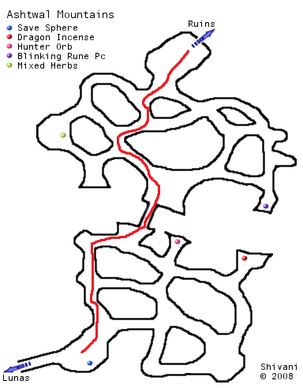

 1. Northwest
 2. Northwest
 3. Northeast, go across bridge
 4. Northwest
 5. North then Northeast

<Menu>

##### Hero's Party
 * [2U] Flail
 * [] Bernadette
 * [2D] Dinn
 * [1R1D] Lance
 * [1R1U] Nifsara

##### Lyon's Party
 * [1R2U] Miakis
 * [1R1U] Roog
 * [3U] Goesch
 * [3D] Faylon

##### Georg's Party
 * [3D] Galleon
 * [] Cathari

</Menu>

### Ashtwal Ruins
 1. **Hero & Lyon**: Move to blockade.
 2. **Zweig**: Swap Zweig to Entourage. East at fork, move to blockade & switch to Lyon.
 3. **Lyon**: Press switch, after going down elevator go left to blockade. Switch to Hero.
 4. **Hero**: Press switch.
 5. **Lyon**: Press switch, east to blockade.
 6. **Zweig**: East up elevator, southeast at fork, press switch. Back to fork then north. West at fork, press switch, then north to blockade. Switch to Lyon.
 7. **Hero**: Up elevator, follow path till blockade.
 8. **Lyon**: North at fork, press switch, switch to Hero.
 7. **Hero**: Press Switch. **Swap at switch.**
 9. **Lyon**: North for fight.

#### Girtablulu 8500HP
3 True Men, Striking Arrow

North through corridor, auto switch to Zweig. North for fight.

#### Gudalim 8500HP
4 True Men, Striking Arrow

North into corridor. **DO NOT ENTER NEXT ROOM**.
Use Blinking Rune Pc, swap Cathari for anyone.

Move to next room, auto switch to Hero.
Use Blinking Rune Piece, swap Nifsara for Cathari.
Follow path for next fight.

Striking Arrow does about 300-350 less than True Men here. Need about 2950 per True Men to kill w/ Striking Arrow
#### Enmesharra 8500HP

Georg: "Hero, Lyon! Take some of the party ahead with you!" **Option 2**

<Menu>

##### Party
 * [] Cathari: Party
 * [] Dinn: Party
 * [] Faylon: Party
 * [1D] Galleon: Party
 * [1D] Goesch: Entourage

##### Swap
 * Lyon > Goesch

##### Equip
 * Jizos

</Menu>

#### Dolph Duel
Guard and Special about same length.

| Opponent Dialogue                       | Opponent Action |
|-----------------------------------------|-----------------|
| A move like that was too much for you...| Special         |
| Are you trying... How reckless of you.  | Guard           |
| Are you trying... It's not going to work| Attack          |
| Can you take another one?               | Attack          |
| Do you think you'll be able to do that..| Special         |
| Here I come. See how you hold up.       | Attack          |
| I really do wish you'd try a little...  | Guard           |
| I won't let you suffer long.            | Special         |
| I'm a little surprised to see you...    | Guard           |
| If you can't even dodge a move like...  | Attack          |
| If you're in that much pain, why...     | Special         |
| In your condition, this should be...    | Attack          |
| Is that the best you can do? A move...  | Guard           |
| Is that the best you can do? We'd...    | Special         |
| It's not over yet.                      | Attack          |
| Let me give you the chance to realize...| Guard           |
| Now it's my turn to make a move.        | Attack          |
| Simply withstanding my attacks will...  | Guard           |
| So, you still... But will it last?      | Attack          |
| So, you still... But can you withstand..| Special         |
| Stalling for time? That won't save...   | Attack          |
| Still standing, huh? But can you...     | Attack          |
| Still standing, huh? But will you be a  | Special         |
| That was very good indeed, but it...    | Guard           |
| The more time you waste, the more...    | Guard           |
| Well, that was a surprise. Do you...    | Special         |
| Well, well. What a surprise. I didn't   | Attack          |
| Well, well. What a surprise. Maybe I... | Guard           |
| Would you like a little break?          | Guard           |
| Would you like to try that again?       | Guard           |
| You can't even dodge a move like that?  | Special         |
| You did very well. I guess I should...  | Special / Super |
| You must be really feeling it by now.   | Special         |

Marscal: "Can you swear to me you'll pass the Sun Rune onto the next generation..." Option 1

##### Sun Incarnation 14000HP
2 True Men, Striking Arrow.

Split on fade out to black, GG
